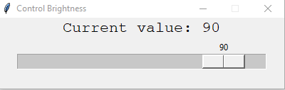
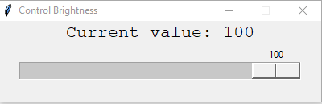

# Brightness Control (Desktop only)

Brightness Control is a tool developed on Python3 and Tkinter. You can change your windows brightness using this application. Currently only supported in windows(Desktop) only.

## Dependencies

* python3
* tkinter

## How to install
Goto [Setup](https://github.com/manjurulhoque/python-brightness-control/releases/download/v1.0/setup.zip) this link download and extract the zip. Then install the setup.exe.

## Screenshots

#### Initial State

#### After changing State

#### Feel free to contribute :blue_heart: